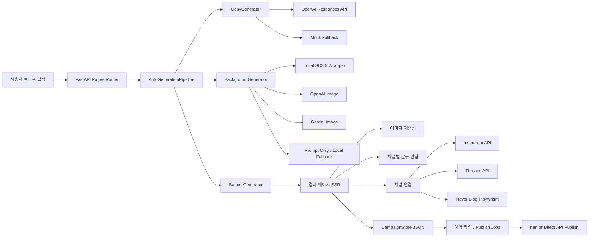
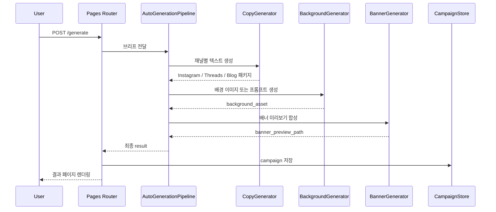

# 소상공인 AI 홍보 자동화 서비스 발표 자료

## 1. 프로젝트 한 줄 소개

소상공인이 상품 정보만 입력하면, Instagram, Threads, Blog에 맞는 홍보 문구와 이미지를 생성하고 게시 준비까지 이어주는 AI 마케팅 자동화 MVP입니다.

발표용 한 줄 버전:

> "브리프 한 번으로 3채널용 홍보 콘텐츠를 만들고, 이미지 재생성, 검수, 예약 게시까지 연결한 소상공인용 AI 홍보 도구입니다."

---

## 2. 문제 정의

### 왜 이 서비스를 만들었는가

- 소상공인은 매일 홍보 콘텐츠를 새로 만들 시간이 부족합니다.
- 같은 상품이라도 Instagram, Threads, Blog는 문체와 정보량이 다릅니다.
- 단순 문구 생성만으로는 실제 운영에 바로 쓰기 어렵습니다.
- 생성 이후에도 이미지 수정, 채널별 검수, 게시 준비, 예약 발행 같은 후속 과정이 필요합니다.

### 해결하고 싶었던 문제

- "콘텐츠 생성"에서 끝나는 도구가 아니라
- "실제로 게시 직전까지 가져갈 수 있는 워크플로"를 만들고 싶었습니다.

---

## 3. 서비스 목표

### 핵심 목표

- 하나의 브리프로 3채널용 콘텐츠를 동시에 생성
- 결과 페이지에서 바로 이미지 재생성
- 채널별 문구를 실시간으로 수정
- 게시 전 검수/예약/연결까지 한 흐름으로 제공

### 의도한 사용자 경험

1. 브리프 입력
2. AI 초안 생성
3. 이미지 다시 만들기
4. 채널별 문구 다듬기
5. 계정 연결
6. 예약 또는 게시

즉, "생성기"가 아니라 "운영형 콘텐츠 워크벤치"를 목표로 설계했습니다.

---

## 4. 데모 시나리오

### 발표 때 보여주면 좋은 흐름

1. 업종, 상호명, 상품명, 혜택만 입력
2. 결과 페이지에서 Instagram / Threads / Blog 초안 확인
3. `이미지 생성` 탭에서 참고 이미지 업로드 후 재생성
4. `콘텐츠 편집` 탭에서 채널별 문구 수정
5. 오른쪽에서 Instagram / Threads / Blog 연결 방식 소개
6. `예약 준비 완료` 또는 `자동 업로드 예약 저장` 시연

### 발표 포인트

- 생성 결과가 채널별로 다르게 나오는 점
- 이미지 생성과 텍스트 생성이 분리되어 있는 점
- Naver Blog는 공식 API 대신 Playwright로 우회한 점
- fallback 구조가 있어서 발표 중에도 완전히 멈추지 않는 점

---

## 5. 전체 서비스 아키텍처

### 사장님이 이해하는 한 장 그림

```text
[사장님이 입력]
업종 / 상호명 / 상품명 / 혜택
          |
          v
[AI가 초안 제작]
- 인스타용 문구
- 스레드용 문구
- 블로그용 문구
- 배너 이미지 초안
          |
          v
[결과 화면에서 사람이 확인]
- 이미지 다시 만들기
- 문구 수정하기
- 채널별 미리보기 보기
          |
          v
[연결하고 내보내기]
- 인스타 연결
- 스레드 연결
- 블로그 연결
- 예약 저장 / 바로 게시
          |
          v
[기록 보관]
- 생성 이력 저장
- 다음에 다시 열기
- 같은 내용으로 재생성
```

### 이 그림을 쉬운 말로 설명하면

- 사장님은 복잡한 설정 대신 "가게 정보"만 넣습니다.
- AI는 그 정보를 바탕으로 채널별 홍보 초안을 한 번에 만듭니다.
- 바로 올리는 게 아니라, 결과 화면에서 사람이 한 번 더 보고 수정할 수 있습니다.
- 마지막에 채널을 연결하면 예약하거나 게시할 수 있습니다.
- 만든 결과는 저장해두기 때문에 나중에 다시 열어서 이어서 작업할 수 있습니다.

### 왜 이 흐름이 중요한가

- 단순히 글만 뽑아주는 서비스가 아닙니다.
- 실제 장사하시는 분 입장에서는 "만들기 -> 보기 -> 고치기 -> 올리기"가 한 번에 이어져야 편합니다.
- 그래서 이 서비스는 생성기보다 "홍보 작업실"에 가깝게 설계했습니다.

---

### 기술자용 구조를 쉬운 그림으로 바꾸면

```text
사장님
  |
  v
입력 화면
  |
  v
AI 제작실
  |
  |-- 문구 만드는 칸
  |     -> 인스타 문구
  |     -> 스레드 문구
  |     -> 블로그 문구
  |
  |-- 이미지 만드는 칸
  |     -> 배경 이미지
  |     -> 배너 미리보기
  |
  v
결과 확인 화면
  |
  |-- 이미지 다시 만들기
  |-- 문구 수정하기
  |-- 3채널 미리보기
  |
  v
게시 연결실
  |
  |-- Instagram API
  |-- Threads API
  |-- Naver Blog 자동화
  |
  v
저장소
  |
  -> 이력 저장 / 예약 저장 / 다시 불러오기
```

### 발표할 때 이렇게 말하면 됩니다

> "앞단에서는 사장님이 가게 정보를 넣고, 가운데 AI 제작실이 문구와 이미지를 만들고, 뒤에서는 사람이 한 번 더 수정한 다음 채널에 연결해 올리는 구조입니다."

---



### 아키텍처 설명

- FastAPI가 전체 오케스트레이션을 담당합니다.
- 생성 로직은 `Copy`, `Background`, `Banner`로 분리했습니다.
- 저장은 로컬 JSON store로 두어 MVP 속도를 우선했습니다.
- 게시는 채널별 adapter 패턴으로 분리해 확장 가능하게 만들었습니다.

### 비전공자에게 한 줄로 설명하면

> "입력 화면에서 받은 가게 정보를 AI 제작실이 문구와 이미지로 바꾸고, 결과 화면에서 사람이 다듬은 뒤, 각 채널에 맞는 방식으로 보내는 구조입니다."

---

## 6. 핵심 기술 스택

### Backend

- Python 3.12
- FastAPI
- Uvicorn
- Pydantic / Pydantic Settings

### Frontend

- Jinja2 SSR
- HTML
- CSS
- Vanilla JavaScript

### AI / Generation

- OpenAI Responses API
- Structured Outputs(JSON Schema)
- Mock fallback generator
- Pillow
- SD3.5 wrapper 구조
- Gemini / OpenAI image provider 확장 구조

### Publishing / Automation

- Instagram direct API
- Threads direct API
- Naver Blog Playwright
- WordPress REST API
- n8n workflow integration

### Test / Reliability

- pytest
- pytest-asyncio
- FastAPI TestClient

---

## 7. 기술 선택 이유

### 왜 FastAPI인가

- HTML 라우트와 JSON API를 함께 운영하기 좋습니다.
- 이후 OAuth, 예약 게시, 외부 자동화 API로 확장하기 좋습니다.
- MVP지만 서비스 형태로 성장시킬 수 있는 구조를 원했습니다.

### 왜 Jinja2 SSR인가

- React까지 가지 않고도 빠르게 결과 화면을 만들 수 있습니다.
- 발표/데모용으로 초기 로딩이 단순하고 안정적입니다.
- 서버 상태와 생성 결과를 바로 템플릿에 녹여 보여주기 쉬웠습니다.

### 왜 OpenAI Structured Outputs인가

- 단순 텍스트 응답보다 채널별 결과 구조를 안정적으로 받기 위해서입니다.
- Instagram, Threads, Blog 패키지를 JSON Schema로 강제해 파싱 실패를 줄였습니다.

### 왜 fallback 구조를 넣었는가

- API 키 문제, 타임아웃, 로컬 모델 불안정성이 실제 발표/운영에서 자주 발생합니다.
- 완전히 실패하는 서비스보다 "낮은 품질이라도 흐름은 유지되는 서비스"가 MVP 단계에서 더 중요하다고 판단했습니다.

### 왜 Playwright인가

- Naver Blog는 WordPress처럼 명확한 공식 게시 API 경로가 없었습니다.
- 실제 서비스 흐름을 보여주기 위해 브라우저 자동화를 선택했습니다.

---

## 8. 생성 파이프라인 구조



### 이 구조에서 강조할 점

- 텍스트 생성과 이미지 생성을 분리했습니다.
- 이미지 재생성만 따로 다시 돌릴 수 있습니다.
- 결과를 저장하기 때문에 "생성 → 검수 → 수정 → 게시" 흐름으로 이어집니다.

---

## 9. 이미지 생성 구조

### 이미지 생성 제공 방식

- 기본: 로컬 SD3.5 wrapper(`sdxl-turbo` 중심)
- 대안: OpenAI image
- 대안: Gemini image
- 안전장치: prompt only / local fallback

### 왜 이렇게 설계했는가

- 발표/개발 환경에 따라 사용할 수 있는 이미지 생성 방식이 달랐습니다.
- 어떤 provider를 쓰든 결과 페이지 흐름은 유지되도록 adapter 형태로 분리했습니다.
- 업로드 이미지를 넣으면 사진을 최대한 살린 배너 미리보기가 나오도록 조정했습니다.

### 발표 시 강조 포인트

- 브리프 단계에서는 이미지를 받지 않음
- 결과 페이지에서 참고 이미지를 넣어 다시 생성
- 생성 중 경과 시간과 단계 표시
- Gemini / Nano Banana 탭으로 별도 확장 가능

---

## 10. 게시 구조

### 채널별 전략

- Instagram: 공식 API direct publish
- Threads: 공식 API direct publish
- WordPress: REST API publish
- Naver Blog: Playwright browser automation
- Mock: 발표와 테스트용 게시 경로

### 왜 채널마다 방식이 다른가

- 가능한 채널은 공식 API를 우선 사용
- 공식 API가 부족한 채널만 자동화 브라우저로 보완
- 실제 운영을 고려하면 "공식 방식 우선, 자동화는 예외"가 더 안전합니다.

---

## 11. 저장 구조와 상태 관리

### 현재 저장 방식

- `data/campaigns.json`
- `data/channel_connections.json`
- `data/naver_blog_storage_state.json`
- `data/naver_blog_profile/`

### 왜 DB 대신 JSON 저장소를 썼는가

- MVP 속도를 우선했습니다.
- 생성 이력과 예약 큐 구조 검증이 먼저 필요했습니다.
- 이후 SQLite / PostgreSQL로 이전 가능한 구조로 설계했습니다.

### 상태 관리 포인트

- Campaign 상태: 초안 / 예약 준비 완료 / 예약됨 / 게시 완료
- Publish Job 상태: queued / published / failed
- Naver Blog 연결 상태: waiting / connected / failed

---

## 12. 안정성 설계

### 신경 쓴 부분

- OpenAI 타임아웃 시 mock fallback
- SD3.5 불안정 시 local fallback
- 결과 페이지에서 이미지 재생성 가능
- 생성 이력 저장
- 테스트 코드로 회귀 방지

### MVP에서 중요하게 본 것

- "최고 품질"보다 "흐름이 끊기지 않는 경험"
- 실패해도 사용자에게 다음 행동이 보이는 UX

---

## 13. 테스트와 품질 관리

### 테스트 방식

- 페이지 렌더링 테스트
- 이미지 재생성 흐름 테스트
- 저장소/예약 큐 테스트
- 게시 adapter 테스트
- Naver Blog 연결 테스트

### 품질 평가

- 고정 테스트셋 기반 생성 품질 평가
- 채널별 점수와 전체 점수 관리
- 광고 문구 구조, 키워드 반영, CTA, 채널 적합도 확인

### 발표에서 말할 수 있는 한 줄

> "기능이 돌아가는지뿐 아니라, 생성 결과가 실제로 쓸 만한지까지 별도 평가 체계를 두고 검증했습니다."

---

## 14. 보안과 운영 고려

### 보안 설계

- `.env`와 `.venv`는 git 제외
- generated 파일과 로컬 세션 파일 git 제외
- 실제 API 키는 코드에 하드코딩하지 않음

### 운영 관점에서 남은 과제

- OAuth 고도화
- Naver Blog 세션 저장 보안 강화
- JSON 저장소에서 DB로 이전
- 공개 URL 스토리지 구조 개선

---

## 15. 한계와 트레이드오프

### 현재 한계

- Naver Blog는 DOM 변경과 로그인 정책에 민감함
- 로컬 SD 계열은 환경에 따라 느리거나 불안정할 수 있음
- 현재 저장소는 JSON 기반이라 다중 사용자 운영에는 한계가 있음

### 대신 얻은 것

- 빠른 MVP 구현
- 발표 가능한 end-to-end 흐름
- 채널별 adapter 구조
- 실제 서비스로 확장 가능한 아키텍처

---

## 16. 앞으로의 확장 방향

### 1차 확장

- Instagram / Threads OAuth 실제 도입
- WordPress category, tag, draft 기능 확장
- Naver Blog 연결 UX 안정화

### 2차 확장

- SQLite/PostgreSQL 전환
- 백오피스형 캠페인 관리 화면
- 다중 사용자 계정 분리
- 스토리지 분리(S3 등)

### 3차 확장

- 댓글/문의 분석
- 광고 성과 회고 기반 재생성
- 채널별 A/B 카피 실험

---

## 17. 발표 마무리 멘트

이 프로젝트는 "AI가 문구를 한 번 만들어주는 도구"가 아니라, 소상공인이 실제 홍보 운영에 가져다 쓸 수 있도록 생성, 수정, 검수, 연결, 예약까지 이어지는 흐름을 설계한 MVP입니다.

핵심은 세 가지입니다.

- 채널별로 다른 콘텐츠를 한 번에 만든다
- 생성 이후의 수정과 운영 흐름까지 고려했다
- 공식 API와 자동화 브라우저를 혼합해 현실적인 서비스 구조를 만들었다

---

## 18. 예상 질문과 답변

### Q. 왜 React가 아니라 Jinja2인가요?

A. MVP 단계에서는 속도와 안정성을 우선했습니다. 이 프로젝트는 먼저 "생성-검수-예약" 흐름을 검증하는 것이 핵심이었고, FastAPI + Jinja2로도 충분히 서비스형 UX를 만들 수 있었습니다.

### Q. 왜 Naver Blog는 API가 아니라 Playwright인가요?

A. WordPress처럼 명확한 공개 게시 API 구조가 없어서, 실제 사용 흐름을 시연하고 검증하기 위해 Playwright 기반 자동화를 채택했습니다.

### Q. 가장 신경 쓴 기술적 포인트는 무엇인가요?

A. fallback 설계와 adapter 구조입니다. 외부 API나 로컬 모델이 흔들려도 전체 서비스 흐름이 멈추지 않게 하는 데 가장 집중했습니다.

### Q. 바로 서비스화하려면 무엇을 더 해야 하나요?

A. 인증 체계 고도화, DB 전환, 파일 스토리지 분리, Naver Blog 세션 보안 강화가 우선입니다.

---

## 19. 발표용 요약 슬라이드 한 장 버전

### 프로젝트명

소상공인 AI 홍보 자동화 서비스

### 핵심 가치

- 브리프 한 번으로 3채널용 콘텐츠 생성
- 이미지 재생성 + 문구 편집 + 게시 준비
- 공식 API와 브라우저 자동화를 혼합한 현실적 운영 구조

### 사용 기술

- FastAPI / Jinja2 / Pydantic
- OpenAI Responses API / Pillow / SD3.5 wrapper / Gemini 확장 구조
- Playwright / pytest / n8n 연동

### 차별점

- 단순 생성기가 아니라 운영형 워크플로를 가진 MVP

---

## 20. 발표자가 바로 읽을 수 있는 1분 소개

안녕하세요. 제가 만든 서비스는 소상공인이 상품 정보만 입력하면 Instagram, Threads, Blog용 홍보 콘텐츠를 한 번에 생성하고, 결과 페이지에서 이미지 재생성, 채널별 문구 수정, 계정 연결, 예약 게시까지 이어서 처리할 수 있는 AI 홍보 자동화 MVP입니다.

이 프로젝트에서 중요하게 본 건 단순한 문구 생성이 아니라 실제 운영 흐름이었습니다. 그래서 텍스트 생성, 이미지 생성, 배너 합성, 생성 이력 저장, 게시 adapter를 각각 분리했고, OpenAI나 로컬 이미지 생성이 실패해도 전체 흐름이 멈추지 않도록 fallback 구조를 넣었습니다.

또 Instagram과 Threads는 direct API 방식으로, Naver Blog는 Playwright 기반 브라우저 자동화 방식으로 연결해 채널 특성에 맞는 게시 구조를 만들었습니다. 즉, 이 프로젝트는 "AI가 글을 써주는 기능"보다, "소상공인이 실제로 홍보 운영에 쓸 수 있는 end-to-end 구조"를 만드는 데 초점을 맞춘 서비스입니다.
